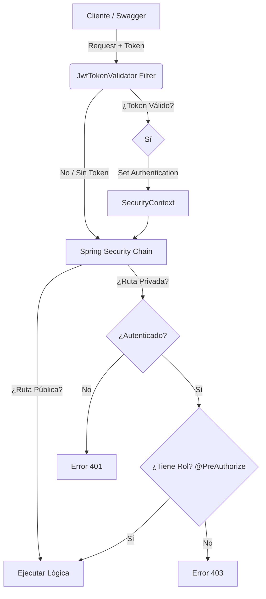

# Sistema de Gestión Académica (Enfoque en Seguridad)

> **Una aplicación Java enfocada en implementar seguridad real, arquitectura escalable y buenas prácticas de backend.**

## 🚀 Live Demo & Documentación Interactiva

Explora y prueba la API en tiempo real sin instalar nada.
La documentación ha sido generada automáticamente con **OpenAPI (Swagger UI)**, permitiendo probar los endpoints directamente desde el navegador.

👉 [**VER DOCUMENTACIÓN SWAGGER UI**](https://educational-platform-71ex.onrender.com/swagger-ui/index.html)

> ⚠️ **Nota Importante (Cold Start):**
> El servidor está alojado en infraestructura de capa gratuita (Render/Railway). La primera petición puede tardar **50-60 segundos** en despertar el servicio. Por favor, ten paciencia.

**¿Cómo probar los endpoints protegidos?**
1. Usa el endpoint `POST /auth/login` para obtener un token (Usuario: `adminPlatform`, Password: `admin1234`).
2. Copia el token `jwt` de la respuesta.
3. Sube al inicio de la página y haz clic en el botón verde **Authorize** 🔓.
4. Pega el token y confirma.
5. ¡Listo! El candado se cerrará 🔒 y podrás probar endpoints seguros como `GET /students`.

---

## 📌 ¿Por qué hice este proyecto?
Vengo de desarrollar una arquitectura de microservicios (puedes verla en mi repositorio `admin_tareas`). Aunque funcionaba bien, me di cuenta de que necesitaba **profundizar mucho más en la seguridad**.

A veces, al dividir todo en microservicios, perdemos de vista lo básico. Por eso decidí "dar un paso atrás" hacia una arquitectura monolítica con este proyecto. Mi objetivo fue **entender y aplicar Spring Security**, creando un sistema donde la seguridad sea la base.

## 🏫 Funcionalidades y Lógica de Negocio

El sistema cumple con las siguientes reglas de negocio y relaciones de datos:

### 1. Modelado de Entidades
Se diseñó la arquitectura (Controladores, Servicios y Repositorios) para gestionar tres entidades principales con las siguientes relaciones:
* **Cursos:** Cada curso tiene una lista de alumnos inscritos y **un solo profesor** asignado.
* **Profesores:** Un profesor tiene la capacidad de impartir **más de un curso**.
* **Estudiantes:** Un alumno puede estar inscrito en **uno o varios cursos** simultáneamente.

### 2. Gestión de Recursos (CRUD)
Se implementaron todos los endpoints necesarios para el manejo completo (Crear, Leer, Actualizar, Eliminar) de:
* ✅ Estudiantes
* ✅ Profesores
* ✅ Cursos

### 3. Matriz de Permisos y Seguridad
La seguridad se configuró para cumplir estrictamente con estos niveles de acceso:

| ROL | Permisos |
| :--- | :--- |
| 🛡️ **ADMIN** | **Control Total:** Puede realizar operaciones CRUD sobre todas las entidades (Cursos, Profesores y Estudiantes). |
| 👨‍🏫 **TEACHER** | **Lectura Amplia:** Puede consultar la información de Cursos, Profesores y Estudiantes. *(Lógica preparada para edición de cursos propios).* |
| 🎓 **STUDENT** | **Lectura Limitada:** Solo tiene permiso para visualizar los Cursos disponibles y el listado de Estudiantes. |

### 🔄 Inicialización Automática
Para facilitar el despliegue y las pruebas, el sistema incluye un componente **Bootstrap** (`CommandLineRunner`).
* **Lógica:** Al arrancar la aplicación, el sistema verifica si la tabla de usuarios está vacía.
* **Acción:** Si no hay usuarios, crea automáticamente el primer **Administrador** utilizando las credenciales seguras definidas en el archivo `.env`.
* **Beneficio:** Permite que el entorno esté operativo inmediatamente después del despliegue, sin necesidad de ejecutar scripts SQL manuales para insertar el primer usuario.

## 🛡️ Arquitectura de Seguridad
La seguridad es el núcleo de este proyecto. Se implementó una estrategia **Stateless** basada en **JWT (JSON Web Tokens)**, eliminando el uso de sesiones de servidor para garantizar escalabilidad.

### Flujo de Autenticación & Autorización:
1. **Filtro Personalizado (`OncePerRequestFilter`):** Intercepta cada petición HTTP antes de llegar a los controladores.
2. **Validación JWT:** Verifica la firma, expiración y estructura del token Bearer.
3. **Contexto de Seguridad:** Si el token es válido, se inyecta la autenticación en el `SecurityContextHolder` de Spring.
4. **Protección Híbrida:**
   - **Nivel Gateway (`SecurityConfig`):** Protege rutas globales y expone endpoints públicos (Swagger, Auth) usando `AuthorizeHttpRequests`.
   - **Nivel Método (`@PreAuthorize`):** Control granular de roles (`ROLE_ADMINISTRADOR`, `ROLE_TEACHER`, `ROLE_STUDENT`) y permisos directamente en los controladores.

### Diagrama de Flujo de Petición


### Decisiones de Diseño en Seguridad:
* **Deny All por defecto:** Usé una estrategia, si se me olvida configurar un endpoint, el sistema lo bloquea por defecto (`denyAll()`).
* **Manejo de Errores:** Implementación de `AuthenticationEntryPoint` para devolver respuestas JSON claras y estructuradas en lugar de errores HTML genéricos cuando falla la autenticación.

---

## ⚙️ Stack Tecnológico
Lo construí con las herramientas estándar del mercado actual:
* **Java 17** y **Spring Boot**
* **Seguridad:** Spring Security + JWT 
* **Documentación:** SpringDoc OpenAPI (Swagger UI)
* **Base de Datos:** MySQL + JPA (Hibernate)
* **Manejo de Datos:** DTOs (Java Records) y Mappers manuales.
* **Despliegue:** Docker Compose.

## 🏗️ Organización del Código
Organicé el código en capas claras para facilitar el mantenimiento y la escalabilidad:

1.  **Capa de Seguridad:** Maneja usuarios, roles y permisos. Totalmente desacoplada de la lógica de negocio académica.
2.  **Capa de Dominio (Student/Teacher/Course):** Aquí reside la lógica y entidades del negocio.
3.  **Capa de Aplicación (Orquestación):**
    * *El reto:* Crear un estudiante implica persistir datos académicos Y crear credenciales de acceso.
    * *La solución:* Servicios orquestadores (como `CreateStudentAccount`) que coordinan ambas operaciones bajo una única transacción (`@Transactional`). Si falla la creación del usuario, se revierte el registro del estudiante.

---

## 🧪 Pruebas de Integración (Postman)
Si prefieres realizar pruebas manuales fuera del navegador, preparé una colección completa que cubre todos los flujos de negocio.

📂 **[Descargar Colección de Postman](./Postman/educationalPlatform.postman_collection.json)** (Asegúrate de tener esta carpeta en tu repo)

**Escenarios incluidos:**
- ✅ Flujo completo de Autenticación.
- ✅ Gestión de Estudiantes (CRUD completo con validaciones).
- ✅ Asignación de Permisos y Roles.
- ✅ Flujos de error controlados.

---

## 🚀 Instalación y Despliegue Local

Este proyecto utiliza variables de entorno para una configuración segura.

### 📋 Pre-requisitos
* **Opción Recomendada:** Docker y Docker Compose.
* **Opción Manual:** Java 17, Maven y MySQL.

### ⚙️ Configuración (Paso Obligatorio)
⚠️ **Importante:** El proyecto **no arrancará** si no realizas este paso.

1.  **Clonar el repositorio:**
    ```bash
    git clone [https://github.com/Jmrj24/educational-platform.git]
    ```

2.  **Configurar Entorno:**
    Copia el archivo `.env.example` y renómbralo a `.env`. Completa las variables:

    | Variable | Descripción | Valor para DOCKER 🐳 | Valor para LOCAL 💻 |
    | :--- | :--- | :--- | :--- |
    | `MYSQL_ROOT_PASSWORD` | Pass root MySQL | Define una contraseña | (Tu config local) |
    | `BD_URL` | Conexión JDBC | `jdbc:mysql://mysql-container:3306/nombre_db` | `jdbc:mysql://localhost:3306/nombre_db` |
    | `BD_USER` | Usuario de la Base de Datos | `root` | Tu usuario local (ej: root) |
    | `BD_PASSWORD` | Contraseña de la Base de Datos | La misma que `MYSQL_ROOT_PASSWORD` | Tu contraseña local |
    | `APP_USER` | **User Admin Inicial** | Ej: `admin@mail.com` | Igual |
    | `APP_PASSWORD` | **Password del primer Administrador** | Define una contraseña segura | Igual |
    | `PRIVATE_KEY` | Firma JWT | String aleatorio seguro | Igual |
    | `USER_GENERATOR` | Emisor del Token | Ej: `SAS_API` | Igual |

> 🐳 **Nota para Docker:** En `BD_URL`, asegúrate de que el host (ej: `mysql-container`) coincida con el nombre del servicio de base de datos definido en tu archivo `docker-compose.yml`.

### 🐳 Opción A: Ejecutar con Docker (Recomendado)
Docker Compose leerá el archivo `.env` automáticamente.

```bash
docker-compose up --build
```

### 🛠️ Opción B: Ejecución Manual
Asegúrate de tener MySQL corriendo y que las credenciales en el `.env` coincidan con tu servicio local.

```bash
mvn clean install
java -jar target/*.jar
```
---
## 🧪 Testing y Calidad de Código (En Desarrollo 🚧)

Este proyecto incluye una base sólida de pruebas automatizadas enfocadas en los flujos críticos del negocio.

* **Stack de Pruebas:** Implementadas con **JUnit 5** y **Mockito** para aislar correctamente las capas de servicios y controladores.
* **Cobertura:** Uso de **JaCoCo** para el análisis, medición y reporte del *Code Coverage*.
* **Manejo Global de Excepciones:** Uso de `@ControllerAdvice` para atrapar errores internos de Spring y devolver respuestas HTTP limpias y estructuradas.

### 🗺️ Roadmap de Pruebas Unitarias

**Completado:**
- [x] Flujos de creación y eliminación (Estudiantes/Profesores + Cuentas).
- [x] Lógica de transacciones para inscripciones a cursos y asignaciones de profesores.
- [x] Bootstrap inicial (Verificación y creación automática del perfil Administrador).

**En progreso / Próximos pasos:**
- [ ] Completar Controladores y Servicios de Estudiantes y Profesores.
- [ ] Dominios de Catálogo (Cursos).
- [ ] Dominios de Seguridad y Acceso (Usuarios, Roles, Permisos).
---
**Autor:** Jeferson Rosales
*Proyecto realizado con fines de práctica profesional y profundización en arquitectura de software.*